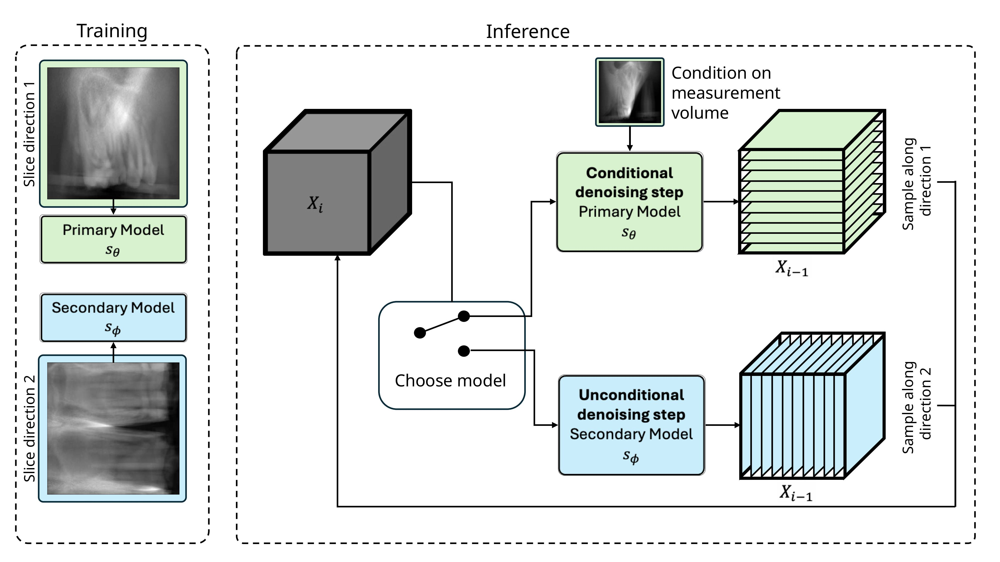

# 3D CBCT Artefact Removal Using Perpendicular Score-Based Diffusion Models

This repository `TPDM_Implant_Inpainting` is the official implementation of the paper "3D CBCT Artefact Removal Using Perpendicular Score-Based Diffusion Models".




## Abstract
Presented is the code for a novel 3D inpainting approach based on two perpendicular score-based diffusion models.

## Getting started

## 1. Train two perpendicular score-based diffusion models
Train the two perpendicular diffusion models independently of the TPDM sampling procedure using [score-SDE](https://arxiv.org/abs/2011.13456). PLease refer to this repository [repository](https://github.com/yang-song/score_sde).

> NOTE: `TPDM`'s sampling code is only implemented for variance-exploding SDE (VE-SDE).

See the `./configs/default_lsun_configs.py` and `./configs/ve/BMR_ZSR_256.py` for the configurations we used to train `score-SDE` model. 


### 2. Install TPDM dependencies

Here's a summary of the key dependencies.
- python 3.10
- pytorch 1.13.1
- CUDA 11.7

We highly recommend using [conda](https://docs.conda.io/en/latest/) to install all of the dependencies.

```bash
conda env create -f environment.yaml
```

### 3. Set up your own dataset
Place your inference volume in the following directory. The structure should look like this:
```
tpdm
├── dataset_sample
│   ├── Synthetic_Projections
│   │   ├── 000.npy
│   │   ├── 000.png
│   │   ...
│   │   ├── 255.npy
│   │   └── 255.png
│   ...
```

### 4. Run `TPDM` for an inpainting task

You can see the various arguments for all executables as shown below. There are many more arguments than the ones shown in the example.  Additional arguments allow you to adjust the various hyperparameters such as the problem-related factor, DPS weight, and K.

```bash
python run_tpdm_inpainting.py --help
```

Please don't rely on automatic DPS weights, as the optimal DPS weight can vary depending on the type of problem, parameters of the problem, measurements, and batch size. This is for reference only.
